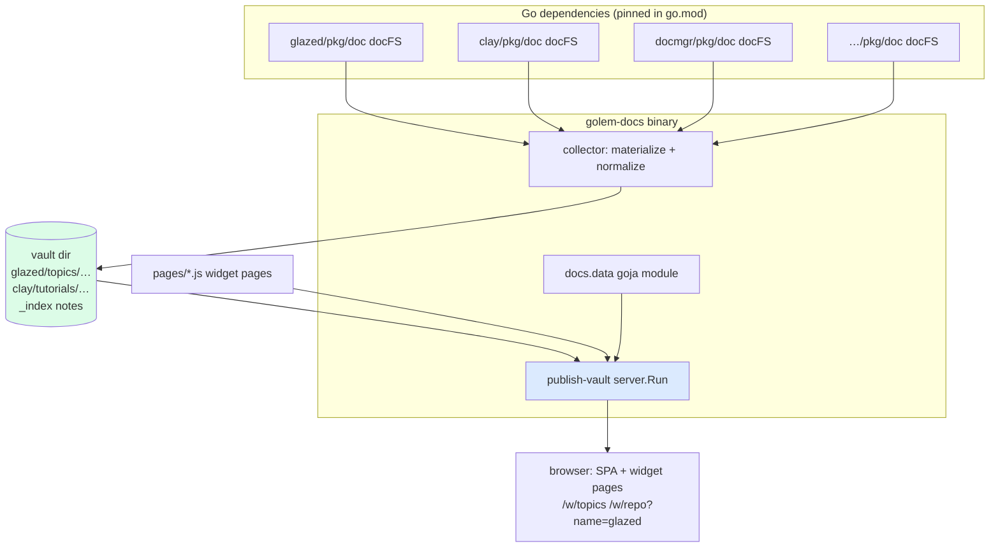

# Docs server analysis and implementation guide

## 1. Executive summary

Every go-go-golems CLI ships its documentation inside the binary: markdown files
with YAML frontmatter, embedded via `go:embed`, loaded into the glazed help system,
and browsed with `<tool> help <topic>` in a terminal. That documentation is good and
plentiful — and invisible to anyone who has not already installed the tool.

golem-docs turns that same content into a web site. It is deliberately a *thin*
application: it does not implement a server, a search index, a markdown renderer, or
a UI. All of that comes from the publish-vault framework
(`github.com/go-go-golems/publish-vault`, made importable by ticket
PV-FRAMEWORK-017 in that repository). What golem-docs adds is exactly three things:

1. a **collector** that materializes each dependency's embedded doc filesystem into
   a vault directory on disk, normalizing frontmatter on the way;
2. a **`docs.data` goja module** exposing help-system-specific queries (sections by
   type, by topic, by command) to server-side JavaScript pages;
3. a set of **widget pages** (JavaScript files) that define the docs UI: a landing
   page, per-repo indexes, a topics browser, an examples browser.

Content updates are dependency updates: the docs for glazed 1.3.6 are whatever
glazed 1.3.6 embeds. `make bump-go-go-golems` (already in the Makefile from
go-template) is literally the "refresh all docs" verb.

## 2. Problem statement and scope

### 2.1 The problem

- Docs for glazed, clay, docmgr, devctl, escuse-me, go-minitrace, etc. exist only
  behind each tool's `help` command.
- There is no cross-repo view: "show me every Tutorial about templates" is
  unanswerable today.
- Carrying a web server inside glazed itself (the alternative the team considered)
  bloats a library with an application concern; hence this separate repository.

### 2.2 In scope

- Aggregate and serve the `pkg/doc` content of go-go-golems repositories.
- Full-text search, tag/topic browsing, per-command reference pages.
- Markdown mirrors and agent-readable indexes (inherited from publish-vault).
- Deployment as a Docker image (same GitOps pattern as publish-vault).

### 2.3 Out of scope (for this ticket)

- Editing docs through the web UI (docs are owned by their source repositories).
- Serving docs for repositories that do not follow the `pkg/doc` convention.
- npm publishing or any frontend fork; the UI is composed from publish-vault's
  widget grammar in JavaScript.

## 3. The two systems an intern must understand

### 3.1 The go-go-golems documentation convention

Every participating repository contains a package `pkg/doc` shaped exactly like
this (from `glazed/pkg/doc/doc.go`, verbatim):

```go
package doc

import (
    "embed"
    "github.com/go-go-golems/glazed/pkg/help"
)

//go:embed *
var docFS embed.FS

func AddDocToHelpSystem(helpSystem *help.HelpSystem) error {
    return helpSystem.LoadSectionsFromFS(docFS, ".")
}
```

The embedded tree contains `topics/`, `tutorials/`, `applications/`, `examples/`
subdirectories of markdown files. Each file has YAML frontmatter with
capitalized keys — the glazed help-section schema (see
`glazed/pkg/help/model/section.go:56` for the full `Section` struct):

```yaml
---
Title: Help System                # display title
Slug: help-system                 # stable identifier
Short: One-line description
Topics: [documentation, help]     # cross-cutting subjects
Commands: [help]                  # CLI commands this doc relates to
Flags: [--topic]                  # flags this doc relates to
IsTopLevel: true
ShowPerDefault: false
SectionType: GeneralTopic         # GeneralTopic | Example | Application | Tutorial
---
markdown body…
```

Verified followers of this convention (grep for `go:embed` in `*/pkg/doc/doc.go`):
glazed, clay, docmgr, devctl, escuse-me, go-minitrace, codex-sessions, discord-bot.
The `fs.FS` seam (`help.HelpSystem.LoadSectionsFromFS(f fs.FS, dir string)`,
`glazed/pkg/help/help.go:119`) is exactly the seam the collector reuses — we read
the same embedded filesystem, but write files to disk instead of loading a help DB.

### 3.2 The publish-vault framework

publish-vault loads a directory of markdown ("a vault") and serves:

- a React SPA (reading view, file tree, backlinks, tag browser, full-text search);
- a JSON API (`/api/notes`, `/api/search`, `/api/tree`, `/api/tags`, `/api/config`);
- markdown mirrors for agents (`/note/<slug>.md`, `/sitemap.md`, `/llms.txt`);
- **widget pages**: JavaScript files in a pages directory, executed server-side in
  a goja VM per request, that return a typed widget IR rendered by the SPA
  (`GET /api/widget/pages/{id}`, actions via `POST /api/widget/actions/{name}`).

The single Go entrypoint golem-docs calls (after PV-FRAMEWORK-017):

```go
server.Run(ctx, server.Config{
    VaultDir:  "...",   // directory of markdown
    Port:      8080,
    VaultName: "go-go-golems docs",
    ServeWeb:  true,    // embedded SPA (build with -tags embed)
    PagesDir:  "...",   // JS widget pages
    // Watch, SSRURL, SearchIndexPath, FaviconPath, ReloadToken…
})
```

Inside a page script, three modules are importable: `widget.dsl` (generic fluent
builders → widget IR), `vault.data` (read-only vault queries), and
`vault.widgets` (note-domain IR helpers: noteHtml, frontmatter, backlinks,
tagList, noteCard, breadcrumb). golem-docs adds a fourth, `docs.data` (§4.3).

## 4. Architecture



### 4.1 The collector

The collector runs at startup (decision D2), before `server.Run`. Pseudocode:

```text
registry = [
  {name: "glazed",  fs: glazeddoc.FS,  repoURL: "https://github.com/go-go-golems/glazed"},
  {name: "clay",    fs: claydoc.FS,    ...},
  ...
]

materialize(target string):
  for entry in registry:
    for each markdown file f in fs.WalkDir(entry.fs):
      fm, body = splitFrontmatter(read(f))
      nfm = normalize(fm, entry)         # §4.2 mapping
      write(target/entry.name/relpath(f), render(nfm) + body)
    write(target/entry.name/index.md, generateRepoIndex(entry))   # links + counts
  write(target/index.md, generateLandingIndex(registry))
```

Notes for the implementer:

- Each repo's docs land under their own subtree (`glazed/topics/…`) so slugs are
  naturally namespaced and the file tree groups by repository (decision D3).
- The registry entry references the dependency's exported embed variable. Today
  `glazed/pkg/doc` exports only `AddDocToHelpSystem`, not `docFS` — the first
  upstream PR of this project makes the FS accessible (either export `DocFS` or add
  a tiny `func FS() fs.FS`). Until then, the collector can go through
  `help.HelpSystem` + `LoadSectionsFromFS` and re-serialize sections, which needs
  no upstream change but loses file layout; prefer the FS export.
- The target directory defaults to a temp dir; `--vault-dir` pins it for
  inspection. Re-running the collector wipes and rebuilds it (content is derived,
  never edited).

### 4.2 Frontmatter normalization

publish-vault's parser reads lowercase Obsidian-style keys; glazed uses
capitalized help-schema keys. The collector translates rather than teaching the
parser two dialects (keeps the framework generic):

| glazed key | vault key | note |
|---|---|---|
| `Title` | `title` | display title |
| `Slug` | (filename) | file becomes `<Slug>.md`; vault derives slug from path |
| `Topics` | `tags` | plus `repo/<name>` and `type/<sectiontype>` synthetic tags |
| `SectionType` | `sectionType` | preserved verbatim for docs.data filtering |
| `Commands`, `Flags` | `commands`, `flags` | preserved for per-command pages |
| `Short` | `description` | listed in indexes and search excerpts |
| `IsTopLevel`, `ShowPerDefault`, `Order` | preserved lowercase | ordering hints for index pages |

Everything not in the table is copied through lowercased. The original frontmatter
is the source of truth; normalization is lossless enough to regenerate upstream
docs mentally from a vault note.

### 4.3 The `docs.data` goja module

`vault.data` answers generic questions (notes, tree, tags, search). The docs UI
needs schema-aware queries, so golem-docs registers one more native module,
following the exact registration pattern of
`publish-vault/pkg/vaultdata` (`Register(reg *require.Registry, provider, config)`):

```js
const docs = require("docs.data");
docs.repos()                       // [{name, count, url, version}]
docs.sections({ repo: "glazed", type: "Tutorial" })
docs.sections({ topic: "templates" })
docs.sections({ command: "help" })
docs.section("glazed/topics/help-system")   // one section, full body
```

Implementation: a thin index built once per vault snapshot (map from
repo/type/topic/command → note slugs), living behind the same `SnapshotProvider`
seam the framework uses, so vault reloads swap it atomically.

### 4.4 Widget pages (the UI)

All UI beyond the stock reading view is JavaScript in `pages/`:

- `home.js` — landing: repo cards with counts and versions (`docs.repos()`),
  shell navigation sidebar listing repos.
- `repo.js` — `?name=glazed`: sections grouped by SectionType, ordered by
  `Order`/`IsTopLevel`.
- `topics.js` — all topics with counts; `?topic=templates` filters.
- `command.js` — `?cmd=help`: every doc mentioning a command; the per-command
  reference view.
- Reading an individual doc uses the stock note view (`/note/glazed/topics/…`) —
  no page needed.

## 5. Decision records

### D1 — Build on publish-vault as a Go dependency (accepted)

- **Options**: (a) import publish-vault framework; (b) fork it; (c) write a docs
  server inside glazed.
- **Decision**: (a). (c) was explicitly rejected by the team (application concern
  in a library repo); (b) forfeits upstream fixes.
- **Consequence**: hard dependency on PV-FRAMEWORK-017 landing. During
  co-development use a `replace` directive to the local checkout; switch to tagged
  versions (`v0.1.0+`) before first deployment.

### D2 — Collect at startup, not at build time (accepted)

- **Options**: (a) startup materialization into a temp/work dir; (b) build-time
  generation baked into the image; (c) live `fs.FS` composition without files.
- **Decision**: (a). Vault loading is fast (publish-vault loads a 980-note vault in
  seconds; the doc corpus is smaller), and startup collection keeps a single code
  path for dev and prod. (c) is elegant but publish-vault's vault loader reads
  from a root directory path today; changing that seam is framework scope creep.
- **Consequence**: container startup does slightly more work; revisit (b) only if
  boot time ever matters.

### D3 — Repo = top-level directory; SectionType = tag, not tree (accepted)

- One mental model: *where* a doc lives is its repo; *what kind* it is
  (Tutorial/Example/…) and *what it covers* (Topics) are tags. Filtering across
  repos then falls out of tag queries instead of tree walks.

### D4 — Content versioning via go.mod (accepted)

- Docs versions are dependency versions. `make bump-go-go-golems` + CI redeploy is
  the entire content-update pipeline. No webhooks, no cron, no scraping.
- **Consequence**: docs lag releases of the source repos until bumped; acceptable
  (docs describe released behavior), and a scheduled bump-PR workflow can automate
  the cadence later.

### D5 — Upstream FS export PRs are part of phase 2 (accepted)

- Each source repo needs its embedded doc FS exported (one-line change). Until a
  repo merges it, that repo is simply absent from the registry — the design
  degrades per-repo, not globally.

## 6. Phased implementation plan

### Phase 0 — Skeleton (this repository, exists)

Template-normalized repo, docmgr initialized, Makefile hardened. Done at ticket
creation.

### Phase 1 — Serve glazed docs end to end

1. `go.mod`: require publish-vault (replace → local checkout while co-developing)
   and glazed.
2. `pkg/collector/`: registry type, `Materialize(target)`, frontmatter
   normalization (§4.2) with unit tests over a fixture FS (use `testing/fstest.MapFS`
   — no upstream export needed for tests).
3. `cmd/golem-docs/`: `serve` command (glazed command pattern, mirror
   publish-vault's `commands/serve/serve.go`): collect → `server.Run`.
4. Smoke: browse `/note/glazed/topics/help-system`, search, tags.

### Phase 2 — Upstream FS exports + fan-out

1. PR to glazed exporting the doc FS; replicate to clay, docmgr, devctl, ….
2. Grow the registry; regenerate; verify per-repo subtrees and landing indexes.

### Phase 3 — docs.data module + widget pages

1. `pkg/docsdata/`: module registration + snapshot-scoped index; VM tests mirroring
   `publish-vault/internal/vaultwidgets/vaultwidgets_test.go` (goja.New + require
   registry + JSON round-trip assertions).
2. `pages/{home,repo,topics,command}.js`; iterate against the live server.

### Phase 4 — Deployment

1. Dockerfile (copy publish-vault's two-stage pattern; build with `-tags embed`).
2. GitOps manifests + publish-image workflow (same shape as publish-vault's).
3. Decide hostname; wire into the k3s cluster.

## 7. Testing and validation strategy

| Layer | How | Failure it prevents |
|---|---|---|
| Normalization | table-driven tests: glazed frontmatter in → vault frontmatter out | silent key drops (Topics vs tags) |
| Collector | `fstest.MapFS` fixture → materialize → assert tree + index notes | path/slug collisions between repos |
| docs.data | goja VM tests with a tiny materialized vault | boundary bugs (values must JSON round-trip) |
| End to end | serve real glazed docs; curl `/api/search?q=…`, `/note/glazed/...`, `/w/home` | integration wiring |
| Content drift | CI step: collector runs against pinned deps without error | an upstream frontmatter change breaking ingestion |

## 8. Risks and open questions

- **publish-vault API stability**: v0.x may move under us; the `replace`-based
  co-development keeps breakage visible immediately.
- **Frontmatter irregularities**: 100+ docs written by hand over years; the
  normalizer must tolerate missing/odd fields (default, log, never crash).
- **Slug collisions**: two repos can both have `topics/templates.md`; the per-repo
  subtree (D3) prevents collisions structurally.
- **Open — hostname and index page branding**: decide before Phase 4.
- **Open — help-system fidelity**: `IsTemplate` sections contain Go template
  syntax meant for terminal rendering; decide render-as-is vs strip in Phase 1.

## 9. References

- `glazed/pkg/doc/doc.go` — the convention this whole design consumes
- `glazed/pkg/help/model/section.go:56` — `Section` schema (frontmatter contract)
- `glazed/pkg/help/help.go:119` — `LoadSectionsFromFS`, the fs.FS seam
- publish-vault `ttmp/2026/07/18/PV-FRAMEWORK-017…/design-doc/` — the framework-ification this depends on
- publish-vault `internal/vaultdata/vaultdata.go:38` — module registration pattern for docs.data
- publish-vault `examples/widget-pages/reader.js` — widget page + shell reference
- publish-vault `cmd/retro-obsidian-publish/commands/serve/serve.go` — serve-command wiring to mirror
